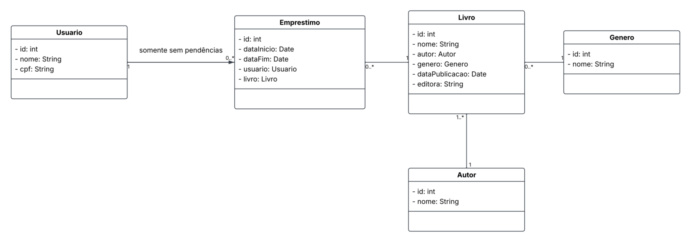

# Biblioteca Web Frontend

Frontend da aplicação de biblioteca, construído com React (+ Vite), TypeScript e Mantine.
Este é o ponto de partida para quem vai criar componentes, corrigir telas ou revisar código.

## Sumário

- [Começando](#começando)
- [Comandos disponíveis](#comandos-disponíveis)
- [Rodando com Docker](#rodando-com-docker)
- [Estrutura do projeto](#estrutura-do-projeto)
- [Usando o Mantine](#usando-o-mantine)
- [Estilização e customização](#estilização-e-customização)
- [Usando ferramentas de IA](#usando-ferramentas-de-ia)
- [Regras de contribuição](#regras-de-contribuição)
- [Como enviar seu código](#como-enviar-seu-código)
- [Checklist antes de enviar](#checklist-antes-de-enviar)
- [Modelo de dados](#modelo-de-dados)

## Começando

### Pré-requisitos

- Node.js 20 ou superior
- npm
- Git
- Docker, caso queira validar a imagem de produção

### Instalação local

Clone o repositório e entre na pasta do projeto:

```bash
git clone <url-do-repositorio>
cd biblioteca-web-frontend
```

Instale as dependências:

```bash
npm install
```

Inicie o servidor de desenvolvimento:

```bash
npm run dev
```

Abra o endereço mostrado no terminal, normalmente `http://localhost:5173`.

O Vite atualiza a página automaticamente enquanto você edita os arquivos.

## Comandos disponíveis

| Comando | Para que serve |
| --- | --- |
| `npm run dev` | Inicia o Vite em modo de desenvolvimento. |
| `npm run format` | Formata arquivos TypeScript, TSX e CSS com Prettier. |
| `npm run lint` | Verifica problemas de ESLint. |
| `npm run build` | Executa o TypeScript e gera a versão de produção. |
| `npm run preview` | Serve localmente o build já gerado. |

Ainda não existe um framework de testes automatizados configurado. Por enquanto, valide o comportamento no navegador e execute `npm run lint` e `npm run build` antes de enviar alterações.

## Rodando com Docker

O `Dockerfile` usa dois estágios: primeiro instala as dependências e gera o build; depois copia o resultado para um servidor Nginx.

### Construir a imagem

```bash
docker build -t biblioteca-web-frontend .
```

### Iniciar o container

```bash
docker run --rm -p 8080:80 biblioteca-web-frontend
```

Abra `http://localhost:8080` no navegador. Para parar, pressione `Ctrl+C` no terminal.

### Validar a versão do container

Depois de iniciar o container, confira:

1. A página abre em `http://localhost:8080`.
2. Não há erros no console do navegador.
3. Os botões, formulários e navegação da alteração funcionam.
4. O layout funciona em uma janela estreita e em uma janela larga.

O build usado pelo Docker também pode ser validado sem container com:

```bash
npm run build
npm run preview
```

## Estrutura do projeto

```text
src/
├── App.tsx              # Componente principal da aplicação
├── main.tsx             # Entrada do React e configuração do Mantine
├── assets/              # Imagens e outros recursos importados pelo código
├── services/            # Acesso a API, mocks e regras de comunicação
├── types/               # Tipos e DTOs compartilhados
└── mockData.ts          # Dados temporários para desenvolvimento

docs/                    # Documentação e imagens do projeto
public/                  # Arquivos públicos servidos sem processamento
```

Ao criar novos arquivos, mantenha cada responsabilidade no lugar mais próximo dela. Tipos que são usados por várias telas devem ficar em `src/types`; chamadas para API devem ficar em `src/services`; componentes reutilizáveis podem ser organizados em uma pasta própria quando essa necessidade aparecer.

## Usando o Mantine

Os estilos base do Mantine já são carregados em `src/main.tsx`:

```tsx
import { Button, Container, Title } from '@mantine/core';

export function BookHeader() {
	return (
		<Container size="lg" py="xl">
			<Title order={1}>Livros</Title>
			<Button mt="md">Adicionar livro</Button>
		</Container>
	);
}
```

Prefira componentes do Mantine em vez de criar HTML e CSS do zero quando já existir um componente adequado. Alguns componentes úteis:

- Layout: `Container`, `Grid`, `Stack`, `Group`, `Flex`, `SimpleGrid`
- Conteúdo: `Title`, `Text`, `Badge`, `Paper`, `Card`, `Alert`
- Formulários: `TextInput`, `Select`, `DateInput`, `Checkbox`, `Button`
- Feedback: `Modal`, `Notification`, `LoadingOverlay`, `Loader`
- Dados: `Table`, `Pagination`, `Tabs`

Consulte a documentação oficial para ver propriedades, exemplos e acessibilidade: <https://mantine.dev/>

### Espaçamento e propriedades responsivas

Use as propriedades do Mantine para espaçamento e layout:

```tsx
<Stack gap="md">
	<TextInput label="Título" placeholder="Digite o título" />
	<Group justify="flex-end">
		<Button>Salvar</Button>
	</Group>
</Stack>
```

Muitas propriedades aceitam valores responsivos. Quando necessário, use `Grid` ou os hooks do Mantine para adaptar a tela a diferentes tamanhos.

### Datas

O projeto já possui `@mantine/dates`, `dayjs` e a localidade `pt-br` configurados. Para campos de data, importe os estilos de datas já carregados em `main.tsx` e siga os exemplos da documentação do Mantine.

## Estilização e customização

Para uma alteração simples, priorize as props de estilo do componente:

```tsx
<Button color="blue" variant="filled" radius="sm" size="md">
	Salvar
</Button>
```

Para estilos locais, use `className` ou `classNames` com um arquivo CSS próximo ao componente. Evite estilos globais sem necessidade.

Para customizar o tema da aplicação, configure o `MantineProvider` em `src/main.tsx`. Exemplo:

```tsx
<MantineProvider
	theme={{
		primaryColor: 'blue',
		defaultRadius: 'sm',
	}}
>
	<App />
</MantineProvider>
```

Não remova `@mantine/core/styles.css` nem `@mantine/dates/styles.css`. Sem esses imports, componentes do Mantine podem aparecer sem o estilo correto.

## Usando ferramentas de IA

As instruções para ferramentas de IA podem ficar na raiz do projeto, em:

```text
AGENTS.md
```

Esse é o local recomendado para regras gerais que qualquer agente deve seguir, como:

- Usar nomes de variáveis em inglês.
- Respeitar o Prettier e a estrutura das pastas.
- Usar Mantine antes de criar componentes ou estilos do zero.
- Executar `npm run format`, `npm run lint` e `npm run build` antes de concluir.
- Não inventar APIs, dependências ou arquivos que não sejam necessários.

Para instruções específicas do GitHub Copilot, também pode ser usado:

```text
.github/copilot-instructions.md
```

Neste projeto, a sugestão é colocar as regras compartilhadas em `AGENTS.md` e usar `.github/copilot-instructions.md` somente para orientações exclusivas do Copilot. Não duplique regras nos dois arquivos sem necessidade, porque elas podem ficar diferentes com o tempo.

Exemplo de organização:

```text
AGENTS.md                         # Regras gerais para agentes de IA
.github/copilot-instructions.md   # Regras específicas do GitHub Copilot
```

Os arquivos de instrução devem ser versionados junto com o projeto. Não coloque neles senhas, tokens, chaves de API ou informações privadas.

## Regras de contribuição

- Variáveis, funções, componentes, interfaces e propriedades novas devem usar nomes em inglês.
- Textos visíveis para o usuário podem ficar em português.
- Siga a formatação do Prettier. Rode `npm run format` antes de enviar.
- Use TypeScript e evite `any` quando um tipo puder ser definido.
- Prefira componentes pequenos e reutilizáveis.
- Não envie código quebrado, imports não utilizados ou `console.log` de teste.
- Não altere configurações globais sem explicar a necessidade na descrição da alteração.
- Preserve acessibilidade: use labels nos campos, botões para ações e elementos semânticos.

## Como enviar seu código

### 1. Atualize sua cópia

```bash
git switch main
git pull origin main
```

### 2. Crie uma branch

Uma branch é uma cópia de trabalho separada. Dê um nome curto e em inglês, por exemplo:

```bash
git switch -c feature/book-form
```

Outros exemplos: `fix/mobile-layout` e `chore/update-dependencies`.

### 3. Faça a alteração e confira o resultado

```bash
npm run format
npm run lint
npm run build
```

Teste também a tela no navegador e, quando a alteração afetar o build final, rode o Docker.

### 4. Veja o que mudou

```bash
git status
git diff
```

`git status` mostra arquivos alterados. `git diff` mostra o conteúdo das alterações. Leia o diff antes de continuar para evitar enviar arquivos acidentais.

### 5. Salve a alteração em um commit

```bash
git add src/caminho/do/arquivo.tsx
git commit -m "Add book form"
```

Adicione somente os arquivos relacionados à tarefa. A mensagem deve explicar a mudança de forma curta, em inglês.

### 6. Envie a branch

```bash
git push -u origin feature/book-form
```

Depois, abra um Pull Request no GitHub. Na descrição, informe:

- O que foi alterado.
- Como testar.
- Prints ou vídeo, quando houver mudança visual.
- Se existe algum ponto pendente ou decisão que precisa de revisão.

Se você não souber Git, pode seguir exatamente os comandos acima. Em caso de conflito ou mensagem de erro, não apague arquivos nem use comandos destrutivos: envie a mensagem completa para o grupo.

## Checklist antes de enviar

- [ ] Os nomes novos estão em inglês.
- [ ] Rodei `npm run format`.
- [ ] Rodei `npm run lint` sem erros.
- [ ] Rodei `npm run build` sem erros.
- [ ] Testei a tela no navegador.
- [ ] Testei estados importantes: carregamento, vazio, erro e sucesso, quando aplicável.
- [ ] Conferi a versão mobile e desktop.
- [ ] Revisei `git diff` e não incluí arquivos que não fazem parte da tarefa.
- [ ] Atualizei a documentação ou os mocks se a alteração exigir isso.

## Modelo de dados

O Diagrama de Entidade-Relacionamento (DER) está em `docs/der.png`:



Os tipos atuais ficam em `src/types` e usam interfaces como `Book`, `User`, `Loan` e seus DTOs de criação. Quando um tipo for compartilhado entre telas ou serviços, adicione-o nessa pasta em vez de duplicar a definição.
